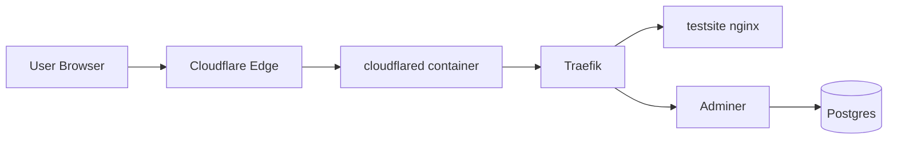

# Scaleton

Fast bootstrap for a production-ready Docker edge stack with:

- Traefik (ingress/reverse proxy)
- Cloudflared tunnel (public exposure)
- Postgres + Adminer
- Test endpoint (`test.<domain>`) for instant verification

Everything is generated and managed through `setup.sh`.

## What This Gives You

- Isolated Docker project per stack (`STACK_ID`)
- Isolated Docker networks (`network-<STACK_ID>`, `network-<STACK_ID>-db`)
- Traefik dashboard behind basic auth (`net.<domain>`)
- Cloudflare tunnel + DNS route automation
- Adminer at `db.<domain>`
- Test page at `test.<domain>`
- Safe reset (`reborn`) that keeps `setup.sh`, `README.md`, and `.git`

## High-Level Architecture



## Setup Flow (Recommended)

1. Initialize base stack config and secrets:

```bash
./setup.sh init
```

2. Initialize Cloudflare tunnel and DNS routes:

```bash
./setup.sh init cf
```

3. Start the stack:

```bash
docker compose up -d --build --force-recreate
```

## Commands

```bash
./setup.sh init
./setup.sh init cf [--relogin]
./setup.sh env
./setup.sh validate
./setup.sh reset database
./setup.sh reset trae
./setup.sh reborn [--yes|--fuckit]
```

### Command Details

- `init`
  - Interactive base bootstrap
  - Generates `.env` with strong random defaults
  - Generates `.gitignore` (basic safe baseline for pushes)
  - Generates `compose.yaml` and `core/*` runtime configs
  - Generates testsite files
  - Prompts for optional project folder rename

- `init cf [--relogin]`
  - Ensures cloudflared is installed
  - Authenticates Cloudflare (`--relogin` forces fresh cert/login)
  - Verifies selected Cloudflare zone matches `PRIMARY_DOMAIN`
  - Creates or reuses tunnel (name = domain)
  - Stores token/id/name in `.env`
  - Applies DNS routes for:
    - `<PRIMARY_DOMAIN>`
    - `*.<PRIMARY_DOMAIN>`

- `env`
  - Rotates `*_SECRET` values in `.env`

- `reset database`
  - Regenerates `POSTGRES_PASSWORD`

- `reset trae`
  - Regenerates Traefik dashboard password hash (`users.htpasswd`)

- `reborn`
  - Stops compose services and removes stack networks/tunnel
  - Deletes generated project files
  - Keeps:
    - `setup.sh`
    - `README.md`
    - `.git`

## Generated Files

After `init` you should have at least:

- `.env`
- `.gitignore`
- `compose.yaml`
- `core/traefik/traefik.yml`
- `core/traefik/users.htpasswd`
- `core/cloudflared/config.yml`
- `core/database/init-databases.sh`
- `core/testsite/index.html`
- `services/postgres/data/` (runtime volume data)

## Access Endpoints

- Traefik dashboard: `https://net.<PRIMARY_DOMAIN>`
- Test page: `https://test.<PRIMARY_DOMAIN>`
- Adminer: `https://db.<PRIMARY_DOMAIN>`

Adminer credentials use your generated `.env` values:

- Server: `postgres`
- Username: `POSTGRES_USER`
- Password: `POSTGRES_PASSWORD`
- Database: `POSTGRES_DB`

## Cloudflare Notes

- Tunnel runtime in Docker uses token from `.env`.
- CLI management (`create`, `route dns`, `delete`) uses `~/.cloudflared/cert.pem`.
- If DNS routes are created in the wrong zone, run:

```bash
./setup.sh init cf --relogin
```

Then choose the correct zone during browser login.

## Troubleshooting

- `network ... has incorrect label`
  - Usually stale/mismatched network metadata from previous compose projects.
  - Run `./setup.sh validate`, then `docker compose up -d --force-recreate`.

- `flag needs an argument: -token`
  - `CLOUDFLARE_TUNNEL_TOKEN` is missing/empty in `.env`.
  - Rerun `./setup.sh init cf`.

- DNS route shows `yourdomain.otherzone.tld`
  - Wrong Cloudflare zone/login cert context.
  - Rerun `./setup.sh init cf --relogin` and pick the correct zone.

## Safety & Hygiene

- Never commit `.env`.
- Never commit `core/traefik/users.htpasswd`.
- Use `reborn --yes` for quick cleanup between experiments.
